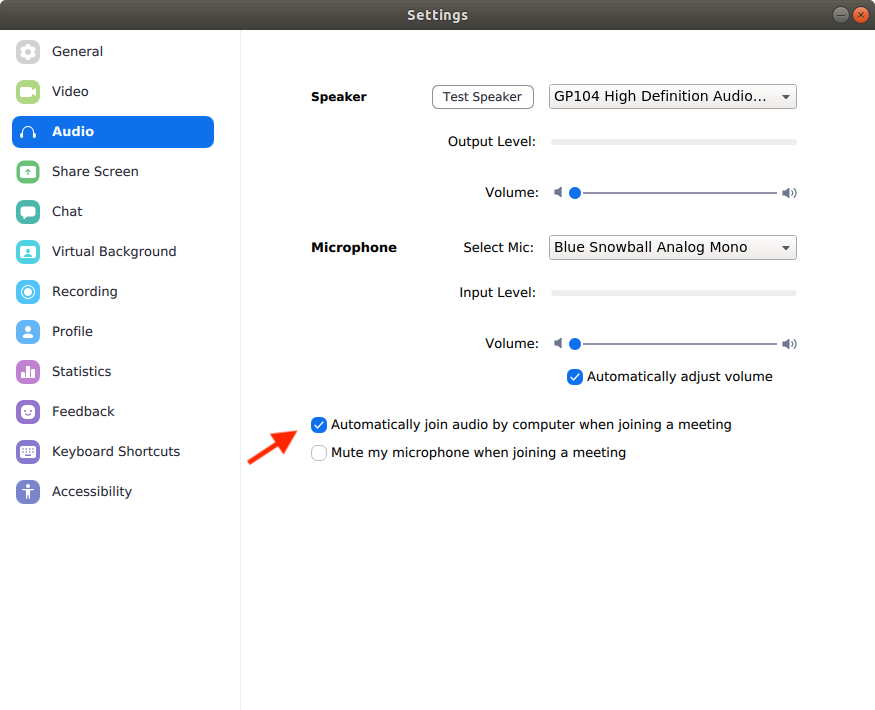

*Note: These instructions were tested on Ubuntu 18.04 LTS.
Our instructions generally follow the software provider's instructions, which we link below.
For other Linux distros, please see the instructions from the software providers.*

## Table of Contents

  - [Zoom](#zoom)
    - [New Zoom Installation](#new-zoom-installation)
    - [Set Up Preferences](#set-up-preferences)
  - [Slack](#slack)
    - [New Slack Installation](#new-slack-installation)
    - [Logging in to the Cancer Data Science workspace](#logging-in-to-the-cancer-data-science-workspace)

## Zoom

### New Zoom Installation

If you do not have Zoom installed yet, you will need to download the client.
To do so, go to <https://zoom.us/download>. You will need to select the appropriate Linux Type, OS Architecture, and Version for your computer.

Click the button to download the latest version of **Zoom Client for Linux**.


When you download the `deb`, select `Save File`.


[The Zoom documentation recommends using GDebi if you are going to use a graphical installer](https://support.zoom.us/hc/en-us/articles/204206269-Installing-or-updating-Zoom-on-Linux#h_75e1dc24-8db1-4b89-8db9-eb049f9b7987).
You can install GDebi by typing the following in a terminal and hitting enter:

```
sudo apt install gdebi
```

You will prompted for your admin password.

Search your computer for GDebi and double click it. 
Open the Zoom DEB installer wih GDebi; you can use `Ctrl+O` and then open the Zoom `deb` file.

Select `Install Package` to install Zoom.


To open Zoom, search your computer and double-click the icon to open it. 
The following window will come up, which you can use to log in and set up preferences.


### Set Up Preferences

Once you've logged into Zoom, use the gear icon in the top right hand corner of the window to bring up the preferences.


Navigate to the `Audio` preferences and select `Automatically join audio by computer when joining a meeting`.



Navigate to `Share Screen` preferences, uncheck `Enter full screen when a participant shares screen` and check `Share selected app window only`.


## Slack

### New Slack Installation

If you do not already have Slack installed, you can download it at <https://slack.com/downloads/linux>. 
Depending on your distribution, download either the `deb` or `rpm` file.
The following instructions are using the DEB installer on Ubuntu ([Instructions from Slack](https://slack.com/help/articles/212924728-Download-Slack-for-Linux--beta-)).

Save the `deb` file to your computer.


Double-click the `deb` file to open the Ubuntu Software Center and then select `Install`.


To open Slack, search your computer for Slack and double-click the icon.

### Logging in to the Cancer Data Science workspace

Open <http://ccdatalab.org/slack> in your browser.
If you have not created an account, follow the prompts to do so.
You will be required to verify your email address first.
Follow the link in the email to set up your account.
Please use your full name in your profile, and don't forget to set a unique password!


After you login, you will see the Slack interface in the browser, but you probably want to open the app for ease of use and the complete feature set.
In the upper left of the window, click on the words **Cancer Data Science** to open the menu, then select "Open the Slack App"


The Slack app you installed should open to the Cancer Data Science Community workspace and you should be all set.
After you have been added to the training-specific channel, say "Hi" and introduce yourself to everyone!

If you are new to Slack, you can get familiar with the interface and features by having a conversation with Slackbot (Slack's resident chatbot) or with yourself.
You can find Slackbot (and yourself) in the left panel, under "Direct Messages".


For more information about how we will be using Slack, please read about our [Slack Procedures](./slack-procedures.md).