We use [Zoom](https://zoom.us/) meetings for conducting CCDL virtual workshops.
In this document, we will cover the procedures for joining a Zoom call and using various features for instruction and consultation sessions.

#### Instructions for setting up Zoom

We have instructions for setting up Zoom for your operating system available.

* [Linux](linux-instructions.md#zoom)
* [Mac](mac-instructions.md#zoom)
* [Windows](windows-instructions.md#zoom)

#### Table of Contents

<!-- START doctoc generated TOC please keep comment here to allow auto update -->
<!-- DON'T EDIT THIS SECTION, INSTEAD RE-RUN doctoc TO UPDATE -->

- [General tips for using Zoom during workshops](#general-tips-for-using-zoom-during-workshops)
  - [Audio](#audio)
  - [Video](#video)
  - [Viewing Zoom while instructors are sharing their screen](#viewing-zoom-while-instructors-are-sharing-their-screen)
  - [Interacting with instructors and providing feedback](#interacting-with-instructors-and-providing-feedback)
    - [Participant pane](#participant-pane)
    - [Chat](#chat)
- [Joining a Zoom call](#joining-a-zoom-call)
  - [Joining a Zoom call via link](#joining-a-zoom-call-via-link)
  - [Joining a Zoom call from Slack](#joining-a-zoom-call-from-slack)
- [Zoom recordings](#zoom-recordings)
- [Using Zoom breakout rooms](#using-zoom-breakout-rooms)
  - [Asking for 1:1 help during instruction](#asking-for-11-help-during-instruction)
  - [Joining a breakout room](#joining-a-breakout-room)
  - [Sharing your screen in Zoom](#sharing-your-screen-in-zoom)
  - [Returning to the main session](#returning-to-the-main-session)
- [Zoom during consultation](#zoom-during-consultation)

<!-- END doctoc generated TOC please keep comment here to allow auto update -->

## General tips for using Zoom during workshops

### Audio

Please make sure your microphone is muted when joining the call and when you are not speaking to minimize background noise during instruction.
You can toggle mute on and off using the `Mute` (or `Unmute` if you are muted) icon on the left side of the controls at the bottom of the Zoom window.

Where possible, please use headphones throughout training to minimize audio feedback.

### Video

If you are experiencing issues with the call quality, turning off your video may help.
This will not affect your ability to see the instructors or content, only outgoing video.
You can toggle video on and off using the Stop Video icon (or Start Video if video is off) on the left side of the controls at the bottom of the Zoom window.

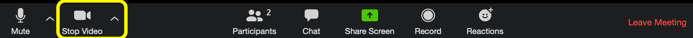

### Viewing Zoom while instructors are sharing their screen

Because you will need to interact with your browser window to work in RStudio during instruction, you likely do not want Zoom to automatically enter full screen mode or maximize the window when the instructor shares their screen.
These are default settings in Zoom that can be turned off.
See the Zoom installation instructions for your operating system for more information, but typically the process involves navigating to Zoom settings or preferences, looking under the **Share Screen** settings, and making sure `Enter full screen when a participant shares screen` and `Maximize Zoom window when a participant shares screen` are unchecked.

### Interacting with instructors and providing feedback

#### Participant pane

The participant pane will both allow you to identify the host and co-hosts of the meeting (CCDL staff) and to provide feedback during instruction.

To bring up the participant pane, click the participants icon in the middle of the controls at the bottom of the Zoom window.

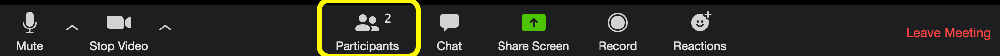

The participant pane will appear on the side of the main Zoom window and look something like this:

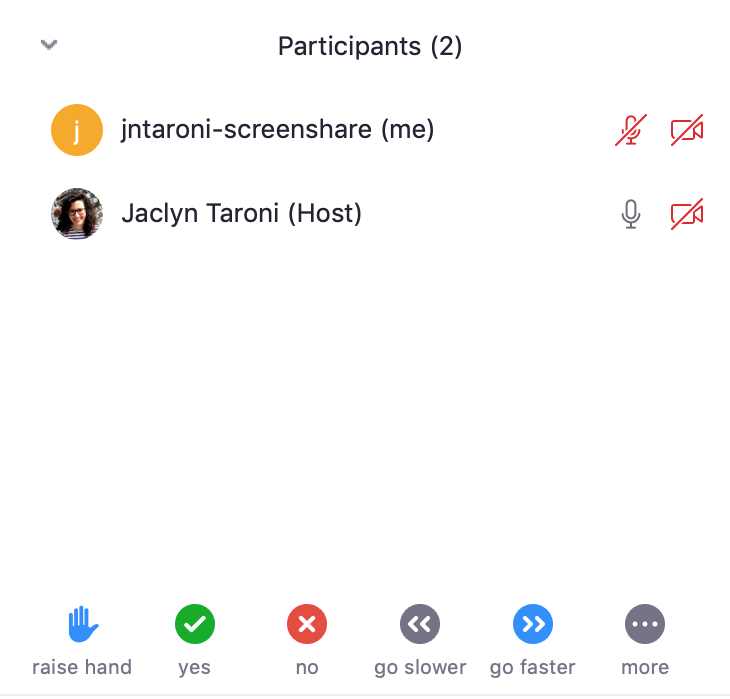

There are feedback controls on the bottom of the participant pane that will allow you to raise your hand, answer yes or no questions, give feedback on the speed of instruction, and under `more` you can indicate if you need a break.

#### Chat

To bring up the chat window to ask questions during instruction, click the chat icon in the middle of the controls at the bottom of the Zoom window.

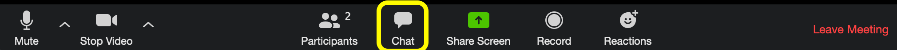

The chat pane will appear below the participant pane.

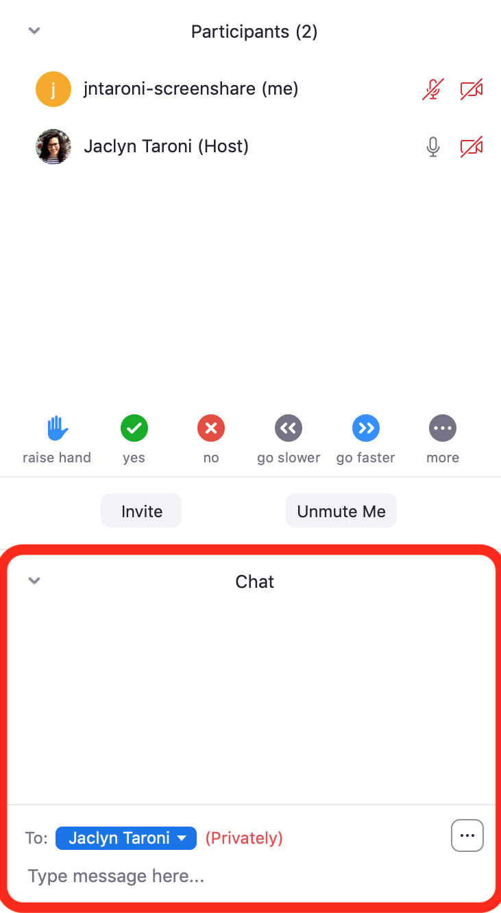

**You should direct your questions to the host of the meeting** by selecting their name from the dropdown menu of the Chat window.
In general, the "host" will not be the instructor, but another member of the CCDL who will coordinate questions and feedback.

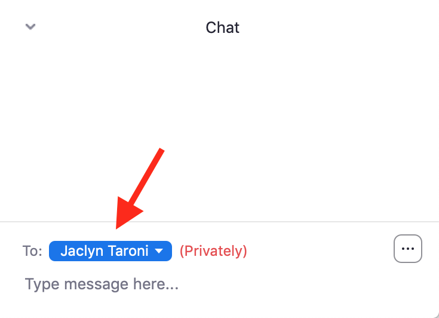

## Joining a Zoom call

CCDL staff will provide you with a link to join a Zoom call for each day during training.
_Please do not share this link._

On the first day of instruction, we will ask you to introduce yourself on the Zoom call so please be ready with computer audio (more on that below).

### Joining a Zoom call via link

Follow the Zoom link you've received.
It should open in your browser.
If you have Zoom installed on your computer, you will be prompted to start the call from the Zoom application and can click the `Open link` or `Open zoom.us` or `OK` button. (_Note: these screen shots were taken on a Mac using Firefox, your interface may look slightly different._)

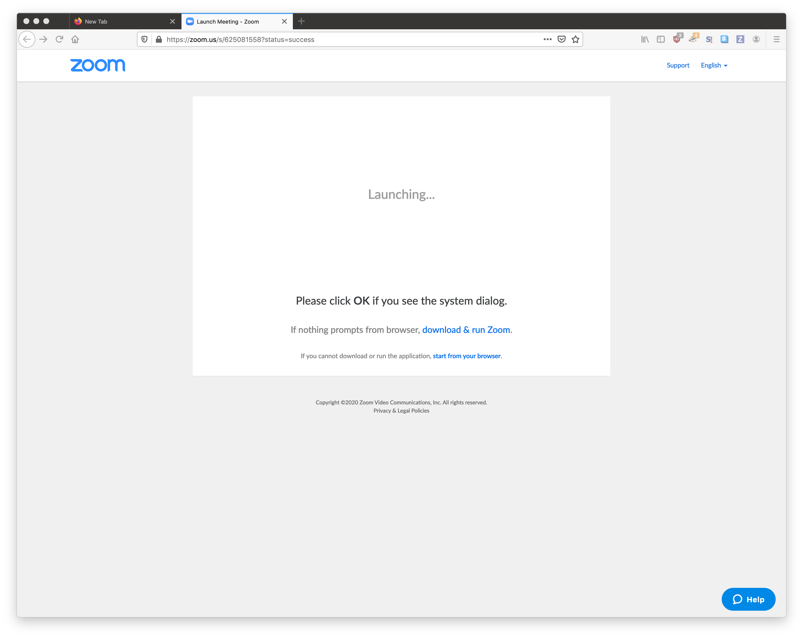

In Firefox, the prompt to launch Zoom looks like this:

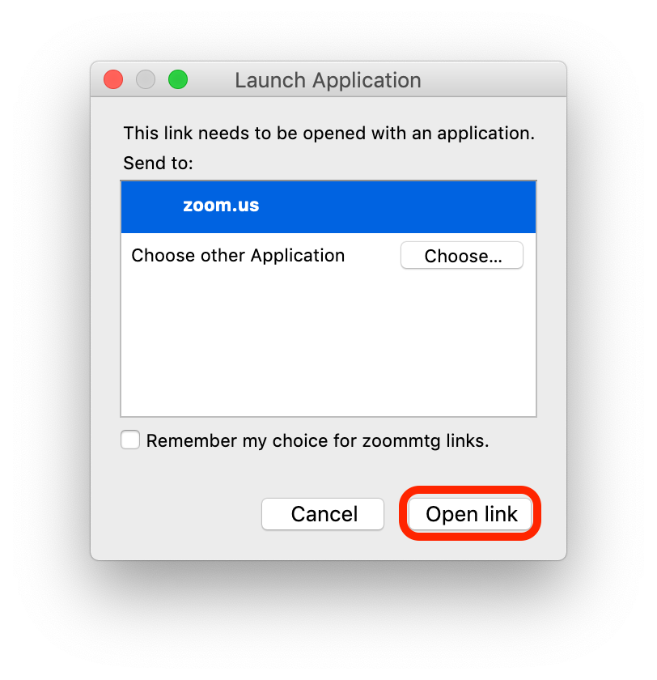

In Chrome, the prompt to launch Zoom looks like this:

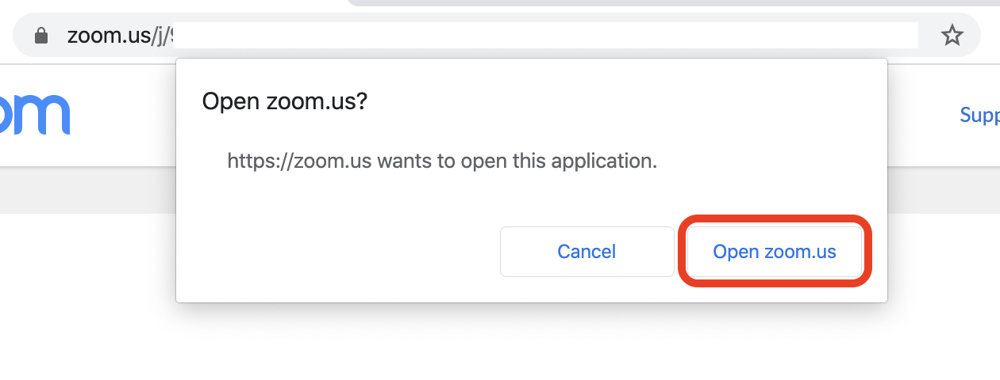

You will also see links that allow you to `download & run Zoom` and to `start from your browswer`.

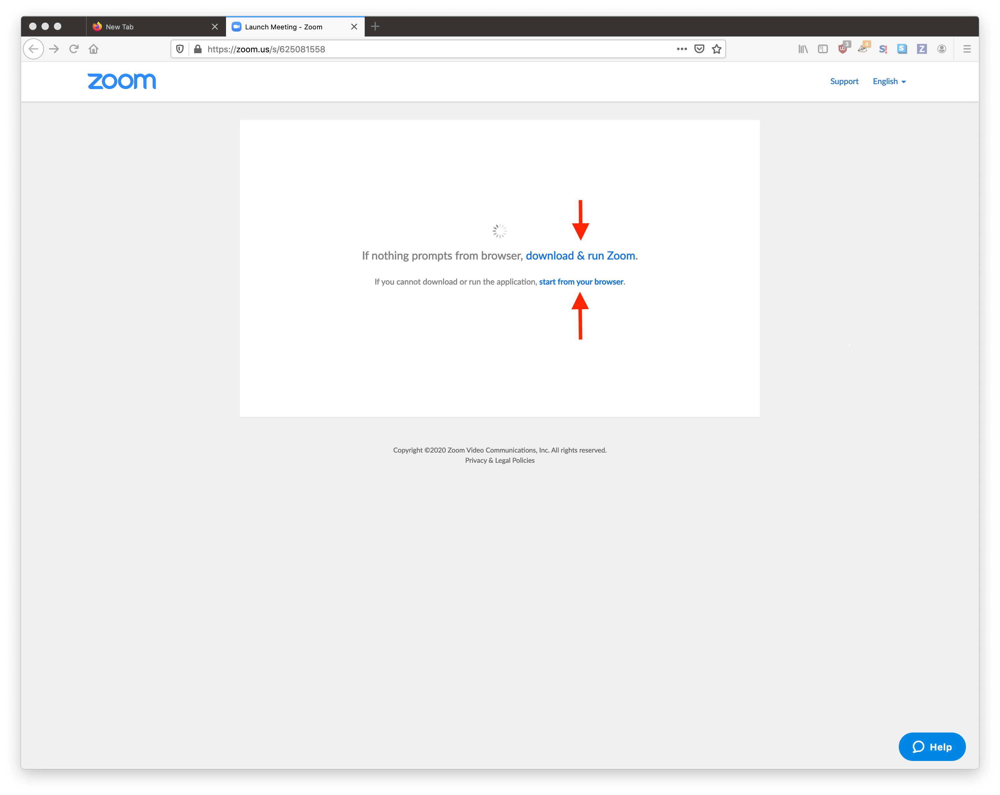

We use a waiting room for our Zoom meetings.
You will see the following window while you are in the waiting room.

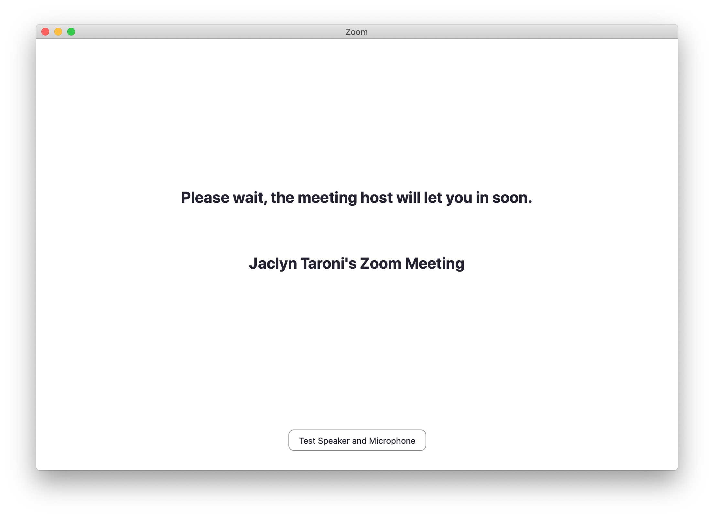

An instructor will let you into the meeting.
To make this process as smooth as possible, **please use a display name that will make it easy to match to your registration form and admit you into the Zoom call.**

If you have trouble connecting, [please send an instructor a direct message on Slack](slack-procedures.md#using-direct-messages-during-training) or email [training@ccdatalab.org](mailto:training@ccdatalab.org).

**Join the call with computer audio** if you see the prompt shown below.
You will also have the option to test your audio and video set up.

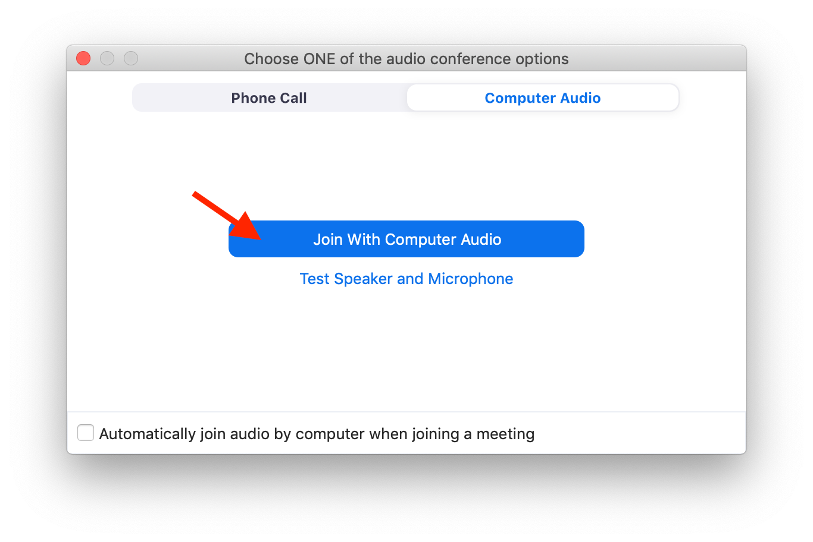

You may find it helpful to check the `Automatically join audio by computer when joining a meeting` checkbox for future Zoom calls during training.

### Joining a Zoom call from Slack

Instructors may use Zoom meetings during consultation sessions so you can share your screen.
Instructors will initiate the call from Slack either in a thread or in a direct message.
To join the call, click the `Join` button:

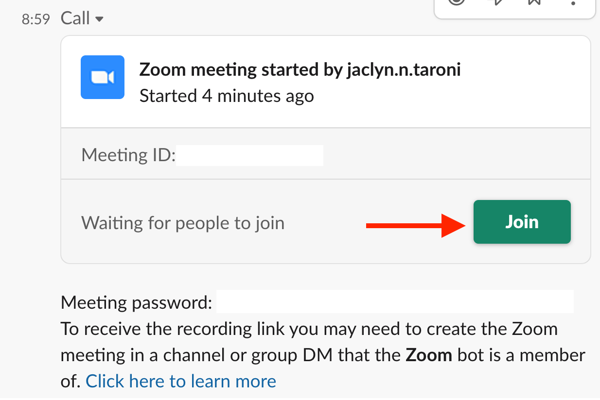

When you click `Join`, the link should open in your browser and all steps should be the same as above.

## Zoom recordings

**We will be recording instruction** to allow course participants to revisit instruction during consultation sessions or in case their connection is disrupted during instruction.

When we are recording, you will be notified by a banner in the top corner of the Zoom interface.
We plan to distribute these recordings to other course participants in your specific training session or as part of training for additional workshop instructors.
We will not post these videos publicly.

_Note: Consent for video recordings is included in the [CCDL training workshop waiver](../ccdl-training-waiver.pdf) signed prior to the start of the training workshop._

## Using Zoom breakout rooms

Zoom breakout rooms are a feature that allow us to assign course participants and instructors to meetings that are smaller than the main session.
We will use Zoom breakout rooms in the following capacities during training:

* To provide 1:1 help during instruction as needed.
* To group participants during exercise portions of instruction.
* _Optionally_ to group participants during consultation sessions who are working on similar tasks or the same exercise notebooks.

### Asking for 1:1 help during instruction

If you need help from an instructor during instruction, message the host of the Zoom meeting and let them know that you need help from an instructor.
We will clearly identify the host of the meeting at the beginning of the session.

To bring up chat, click the chat icon in the control bar.

### Joining a breakout room

The host of the Zoom meeting will assign you to a breakout room if you need 1:1 help and during certain periods of instruction.

When you are assigned to a breakout room, you will see a prompt like the one below.
Click `Join Breakout Room` to go to the breakout room.

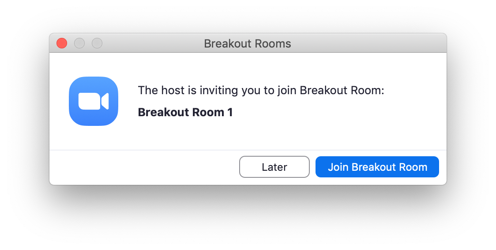

If you were accidentally to hit `Later` **_or_** if you need to return to the breakout room after returning to the main session, you can click the `Join Breakout Room` icon in your control bar.

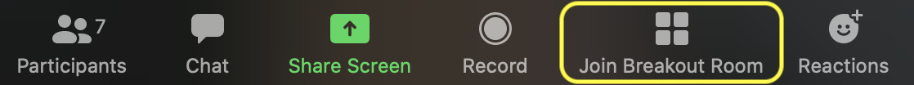

That will bring up the popup window shown below; click `Join Breakout Room`.

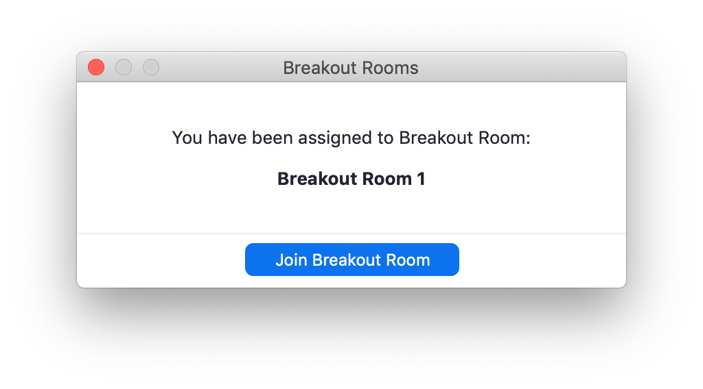

When you're in a breakout room, you may receive messages from the host.
Those messages will appear as green banners at the top of your Zoom window.

### Sharing your screen in Zoom

Sharing your screen in a Zoom breakout room during instruction or one on one Zoom meetings may be required to allow instructors to best provide assistance.
You will also want to share your screen during your presentation at the end of the workshop.

To share your screen, select the `Share Screen` icon in the middle of the control bar at the bottom of the Zoom window.

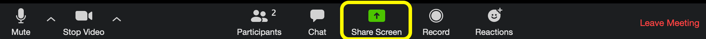

This will bring up a prompt that will allow you to select whether to share your whole desktop or a specific window.
You most likely want to share the browser window with the RStudio interface only.

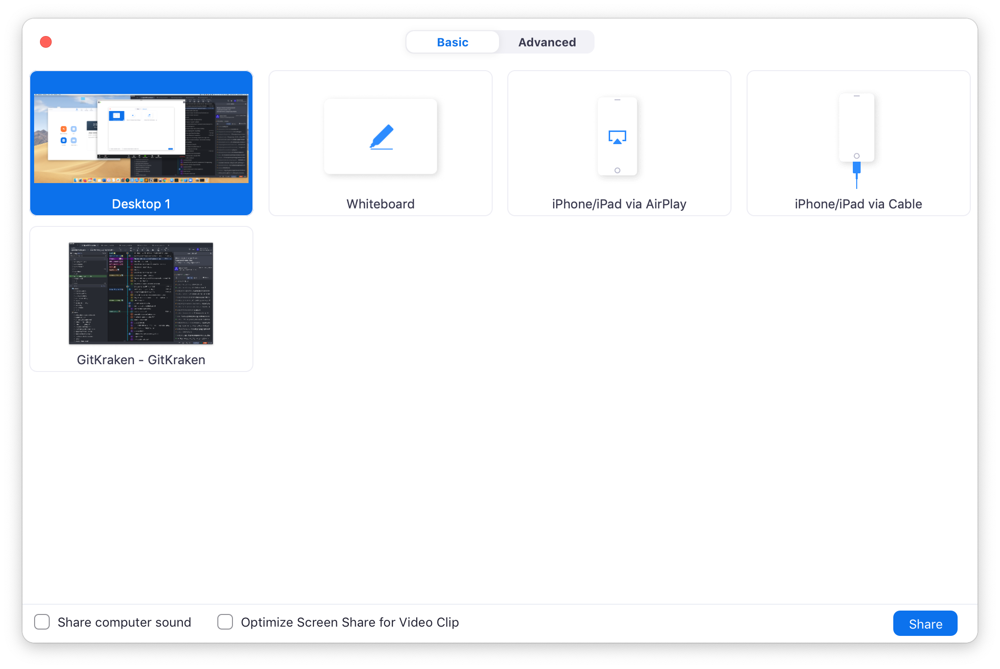

Other participants in the meeting (or just the breakout room if you are in one) should now be able to see your screen.

To shop sharing your screen, click `Stop Share` at the top of the Zoom window.

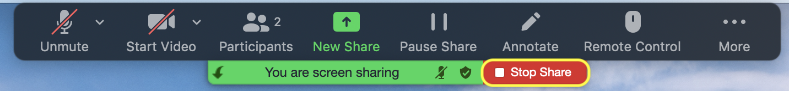

### Returning to the main session

To return to the main session, select `Leave Room` from the control panel.
**Note that you will need to stop sharing your screen to leave the breakout room.**

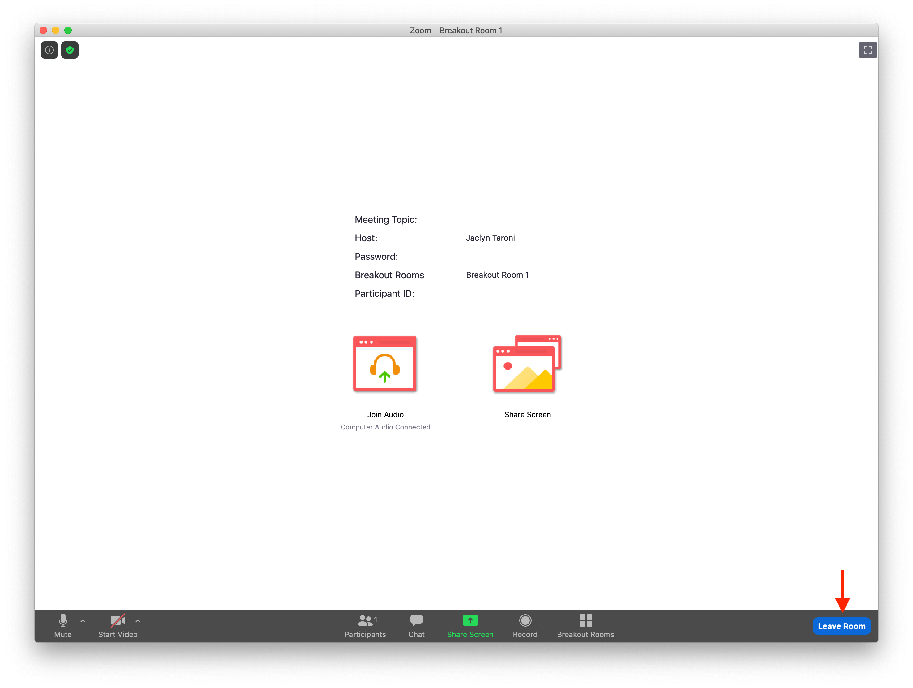

This will bring up a pop up that will give you the option to leave the Zoom call or leave the breakout room. Be sure you select `Leave Breakout Room` or else you will need use the Zoom link in your email or the training Slack channel to rejoin the meeting!

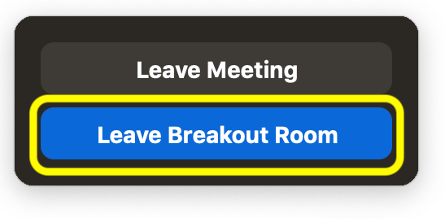

If the host of the meeting closes the breakout rooms at the end of a session, you may see a prompt with a countdown; you can use the `Return to the Main Session` button to return before the countdown ends.

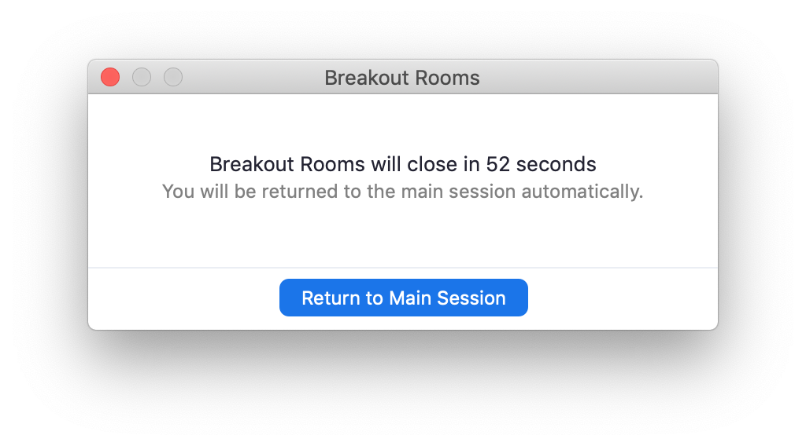

## Zoom during consultation

If you need assistance during a consultation session and it would be helpful to share your screen, an instructor will initiate a Zoom call in Slack either in a thread or direct message.
See [Joining a Zoom call from Slack](#joining-a-zoom-call-from-slack) for instructions for joining that call and [Sharing your screen in Zoom](#sharing-your-screen-in-zoom) for screen sharing instructions.
