The goal of our workshop is to equip you to do initial analyses with your own data!
This guide will take you through how to get your data onto our RStudio server so you can begin analyzing your own data!

## Things to know before uploading your data

- If you are uploading data from human patient sequencing samples, **please be sure that you are doing so in a manner that is consistent with participant consent and your institution’s rules**. The only data that is permissible for upload to our server is that which has been summarized to non-sequence level and has no personally identifiable information (PII) and no protected health information (PHI).

- Initially, we have equipped you with **50 GB of space** (if the data you would like to upload is larger than this, please consult one of the CCDL team members through Slack for assistance).

- If you don't have your own data that you are looking to analyze, but would like real transcriptomic datasets to practice with, see the [Resources for Consultation Sessions page](../workshop/resources-for-consultation-sessions.md) and/or ask a CCDL team member for recommendations.

- You will have access to our RStudio Server for 6 months.
We will email you with a reminder 6 months from now so you can make sure to remove any files from our RStudio Server that you may find useful before your access is revoked and the files are deleted.

- As always, please Slack one of the CCDL team members if you need help with anything (that is what we are here for!).

<!-- START doctoc generated TOC please keep comment here to allow auto update -->
<!-- DON'T EDIT THIS SECTION, INSTEAD RE-RUN doctoc TO UPDATE -->
**Table of Contents**

- [Things to know before uploading your data](#things-to-know-before-uploading-your-data)
- [Load data that is online (from a url)](#load-data-that-is-online-from-a-url)
- [Load data from an a ssh server](#load-data-from-an-a-ssh-server)
- [Upload large files (> 1Gb) from your own computer](#upload-large-files--1gb-from-your-own-computer)
  - [Install FileZilla on Mac](#install-filezilla-on-mac)
  - [Install FileZilla on Windows](#install-filezilla-on-windows)
  - [Install FileZilla on Ubuntu](#install-filezilla-on-ubuntu)
  - [Linking FileZilla to the RStudio Server](#linking-filezilla-to-the-rstudio-server)
  - [Using FileZilla to upload files to the RStudio Server](#using-filezilla-to-upload-files-to-the-rstudio-server)
  - [Using FileZilla to download files to your computer](#using-filezilla-to-download-files-to-your-computer)
- [Upload *small* files (<1 Gb) from your own computer](#upload-small-files-1-gb-from-your-own-computer)
- [Download *small* files (<1Gb) to your computer](#download-small-files-1gb-to-your-computer)
- [Installing packages](#installing-packages)
  - [Finding what packages are installed](#finding-what-packages-are-installed)
  - [Installing a new package](#installing-a-new-package)
    - [install.packages()](#installpackages)
    - [Bioconductor packages](#bioconductor-packages)
  - [More resources on package installation strategies](#more-resources-on-package-installation-strategies)

<!-- END doctoc generated TOC please keep comment here to allow auto update -->

## Load data that is online (from a url)

If you are retrieving your data from online, perhaps from a publicly available repository, we encourage you to use the terminal command `wget`.
`wget` works for `http://` `https://` and `ftp://` URLs.

**Step 1)** Go to the Terminal tab in your RStudio session.

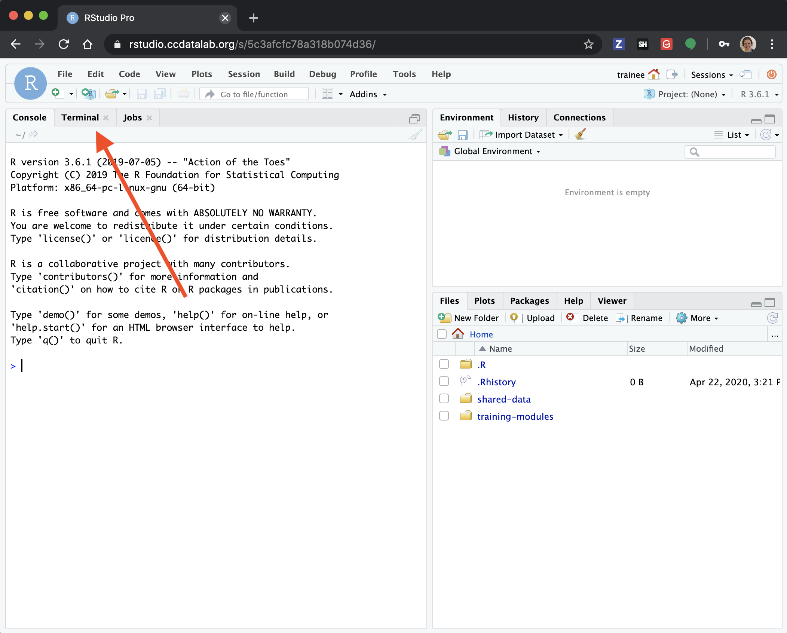

**Step 2)** Copy over the [wget template script]({{site.repository_url}}/tree/master/working-with-your-data/template-scripts/wget-TEMPLATE.sh).

You'll find the `wget` template script in the `shared-data/template-scripts/` directory.
In the RStudio Server, you can click the check mark next to the file name, then go to `More` > and choose `Copy To` to make a copy with a new name somewhere convenient in your home directory.


**Step 3)** Set up your `wget` command in the template script we started for you.

The most simple `wget` command just needs the URL to pull the file from.

*Template:*
```
wget <URL>
```

*Specific example:* Here's an example of us downloading a file from ArrayExpress
```
wget https://www.ebi.ac.uk/arrayexpress/files/E-GEOD-67851/E-GEOD-67851.processed.1.zip
```

By default, the file will be saved to the current directory and the file name it had from its origin (so with the above example `E-GEOD-67851.processed.1.zip`).

Likely you will want to be more specific about where you are saving the file to and what you are calling it.
For that, we can use the `-O`, or `output` option with our `wget` command and specify a file path.  

*Template:*
```
wget -O <FILE_PATH_TO_SAVE_TO> <URL>
```

*Specific example:* Here's an example where we will download that same array express file, but instead save it to the `data` folder and call it `some_array_data.zip`.
(Best to keep the file extension consistent to avoid troubles!)

```
wget -O data/some_array_data.zip https://www.ebi.ac.uk/arrayexpress/files/E-GEOD-67851/E-GEOD-67851.processed.1.zip
```

`-O` is one of many `wget` command options.
To see the complete list of `wget` options, use the command: `wget -h` in Terminal.

[See more `wget` examples](https://www.tecmint.com/10-wget-command-examples-in-linux/)

As is recommended and also shown with this example, this dataset is zipped.
This means after you successfully `wget` the file, you will need to unzip it.
To unzip the contents to a particular directory, we will use the `-d` option.

*Template*
```
unzip -d <DIRECTORY_TO_UNZIP_TO> <FILE_TO_UNZIP>
```

*Specific example:*
Here we will unzip the contents of data/some_array_data.zip to be saved to the directory `data/`.

```
unzip -d data/ data/some_array_data.zip
```

[Go here](https://itsfoss.com/unzip-linux/) for more on the unzipping command.

**If you have a password:**

You can still use `wget` to obtain data if you need credentials.
We don't recommend you put your password or any other credentials in the script or enter your password as part of a command, so you will want to type the following directly into the Terminal:

```
wget --user=<USERNAME> --ask-password <URL>
```
Using the `--ask-password` will prompt you to enter your password.

## Load data from an a ssh server

If you are retrieving your data from an [**s**ecure **sh**ell (ssh) server](https://searchsecurity.techtarget.com/definition/Secure-Shell), like one your institution or lab may host data on, we encourage you to use [the terminal command `scp`](https://linuxize.com/post/how-to-use-scp-command-to-securely-transfer-files/) to copy over your files you'd like to analyze to our server.
(Make sure the data does not violate any of the [privacy issues described above](#things-to-know-before-uploading-your-data).)

**Step 1)** Go to the Terminal tab in your RStudio session.


The `scp` command is a way to copy files securely to or from an ssh server.
It works similarly to the [`cp` command](https://linuxize.com/post/cp-command-in-linux/), which is used for copying files that are all on the same computer.
To understand how this works, we will practice `cp` with some files already in the RStudio Server.

*Template:*
The first argument is the file you'd like to copy.
The second argument is the folder location where you'd like to copy the file from the first argument to.

```
cp <FROM_FILE_PATH> <TO_FILE_PATH>
```

*Example:*
First you'll want to make sure that you are in your home directory:

```
# Navigate to your home directory in Terminal
cd ~
```

Here we will copy this notebook *from* its location in `shared-data/working-with-your-data` *to* our own `training-modules/` folder.

```
cp shared-data/working-with-your-data/retrieve-SRAdb-metadata.Rmd  training-modules/
```

Let's double check it worked by using the `ls` command.

```
ls training-modules
```

You should see `retrieve-SRAdb-metadata.Rmd` printed out in addition to the names of the other folders and files in `training-modules` folder.

Here are more [`cp` examples](https://www.geeksforgeeks.org/cp-command-linux-examples/).
As with other commands, you can use `cp --help` to print out a full list of the options for `cp`.

**Step 2)** Confirm your `ssh` login credentials.
Your institution, or whomever gave you access to the server, should have given you a username and server address as well as more specific instructions on how to log on to the server.

Here's very general examples info about logging into [`ssh`](https://help.liquidweb.com/s/article/Logging-into-Your-Server-via-Secure-Shell-SSH).

*Template*
Generally an ssh login will look something like this:
```
ssh username@server
```

Upon entering this command, it will probably ask you for a password.

Once you are logged into your server, you should try to confirm the file path for the data you are looking to copy.
If you are unsure of the file path of the data you are looking for, we recommend you use [`ls`](https://www.tecmint.com/15-basic-ls-command-examples-in-linux/) and [`find`](https://www.tecmint.com/35-practical-examples-of-linux-find-command/) commands to determine this and copy down the exact file path in your script.

**Step 3)** Set up your `scp` command.

The `scp` command works similarly to the `cp` command we practiced above, except that the `secure` part of copying from a ssh server will require us to supply the server's address and may require us to enter a password.
Just as we practiced with `cp`, the first argument is `FROM` the second argument is `TO`.

*Template:*
The main change with `scp` as compared to `cp` is that we will need to add the server address and a colon.
Whatever login information you used in the previous step is what you will need to use here.
Then we can use the `FROM` and `TO` file paths as before.
Remember to get rid of all `<` and `>`'s.

```
scp <username@server>:<FROM_FILE_PATH> <TO_FILE_PATH>
```

If you are copying a folder of files, you may want to use the `-r` option.
This will `r`ecursively copy all the files in the folder you reference:

*Template:*
```
scp -r <username@server>:<FOLDER_FROM_FILE_PATH> <FOLDER_TO_SAVE_TO>
```

In either situation you will likely be prompted to enter your password.
You can enter it interactively; it's best to not have the password written in a script.

## Upload large files (> 1Gb) from your own computer

FileZilla is a GUI that helps transfer local files to remote servers like our RStudio Server.
We recommend setting up FileZilla if your dataset is larger than a Gb or if you will transfer files to and from the RStudio Server.

### Install FileZilla on Mac

Go to [FileZilla's website](https://filezilla-project.org/download.php?type=client) to download the FileZilla Client.

Click the big green `Download` button.

Click `Download` on this next page for `FileZilla` this is the only free option but will have the functionality you need.

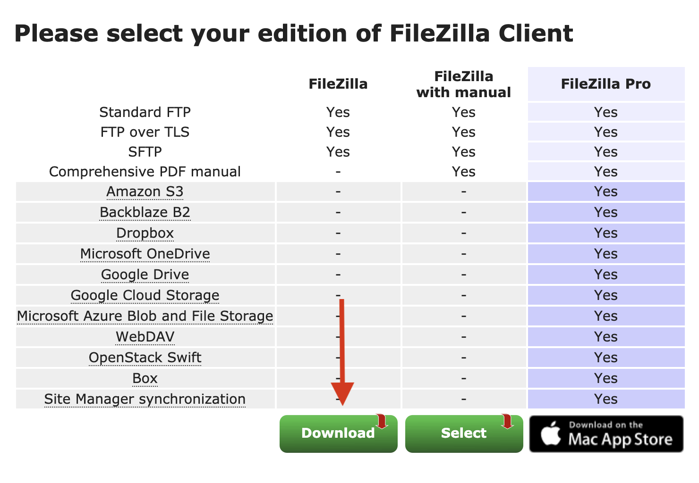

After download is complete, you'll find the `FileZilla`'s `.app.tar.bz2` file in your download files or you can click on it in the corner of your web browser's screen.
Double click on the file to install.

You may want to move the App file to where your other applications are stored.

### Install FileZilla on Windows

Go to [FileZilla's website](https://filezilla-project.org/download.php?type=client) to download the FileZilla Client.

Click the big green `Download` button.

Click `Download` on this next page for `FileZilla` this is the only free option but will have the functionality you need.


After download is complete, you'll find the `FileZilla` `.exe` file in your download files or you can click on it in the corner of your web browser's screen.

Double click on the file to install to begin installation.

You'll be asked if you want to `Allow FileZilla to make changes` click `Yes`.  

There will be a series of steps (like below) you need to click `Next` and `Accept` to them.

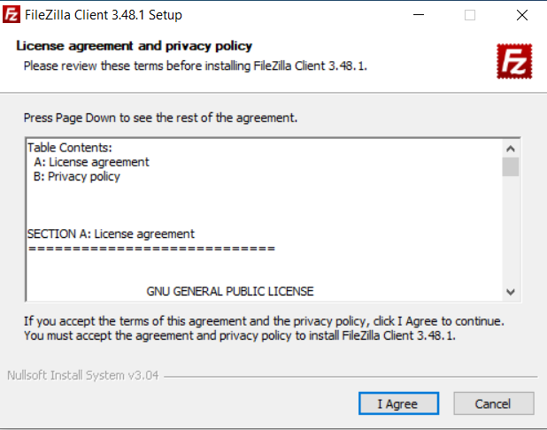

### Install FileZilla on Ubuntu

Navigate to the Ubuntu Software Center and search for FileZilla.
Select FileZilla and then click the `Install` button.

Alternatively, you can install FileZilla via the command line with:

```
sudo apt-get update
sudo apt-get install filezilla
```

### Linking FileZilla to the RStudio Server

Open up the FileZilla application.
At the top of the FileZilla screen, you can enter in the address and your credentials for our RStudio Server (send a message to one of our staff if you forgot your username or password).

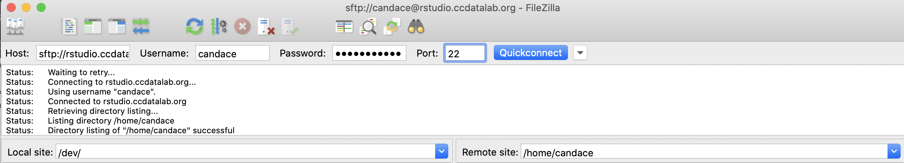


For `Host`, type in `rstudio.ccdatalab.org`.  
For `Username`, type in the username you use to login in to our RStudio server.  
For `Password` type in the password you use to login in to our RStudio server.  
For `Port`, type in `22`.  


Then click the blue `Quickconnect` button.
FileZilla may ask you if you want it to remember your passwords.
We'd suggest creating a master password or using `Do not save password`.

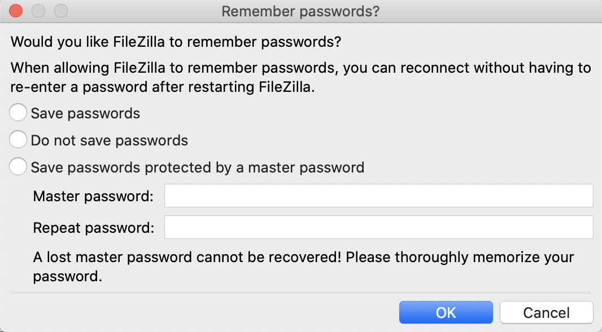

Next, FileZilla will ask you if you should trust our RStudio Server.
You can check the box for `Always trust this host` if you don't want to be asked this again.
Then click `OK`.

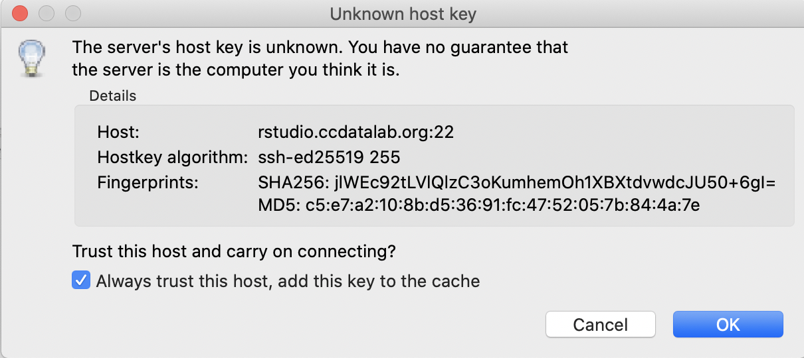

### Using FileZilla to upload files to the RStudio Server

The left side of the FileZilla window shows the files and folders on your computer and the right side shows the files and folders on the RStudio Server, defaulting to show the folders in your "Home" folder (which has the same name as your username).

On the right side, navigate to the folder you'd like to upload the files to on the RStudio Server.

Then, on the left, navigate to the file or folder on your computer you'd like to upload the RStudio Server.
On a Mac, you will likely be asked to allow FileZilla to have access to your files.
Click `OK` for each time.

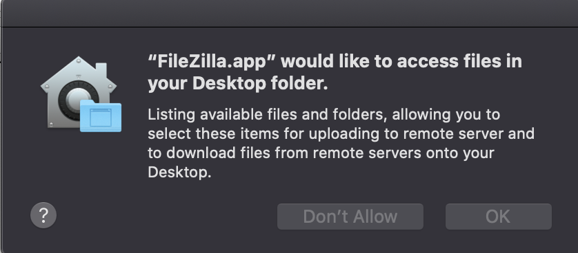

For the folder or file you want to upload, right click on it and choose `Upload`.

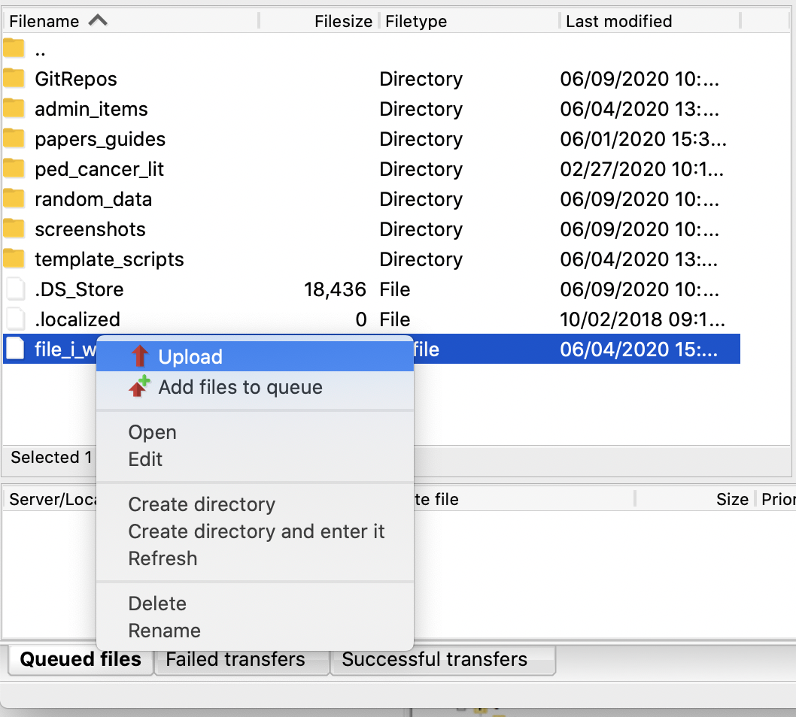

A progress bar on the bottom of the screen will tell you approximately how long it will take to upload.

### Using FileZilla to download files to your computer

The left side of the FileZilla window shows the files and folders on your computer and the right side shows the files and folders on the RStudio Server, defaulting to show the folders in your "Home" folder (which has the same name as your username).

On the left side, navigate to the folder you'd like to download the files to on your computer.

Then, on the right, navigate to the file or folder on the RStudio Server you'd like to download to your computer.

For the folder or file you want to download, right click on it and choose `Download`.

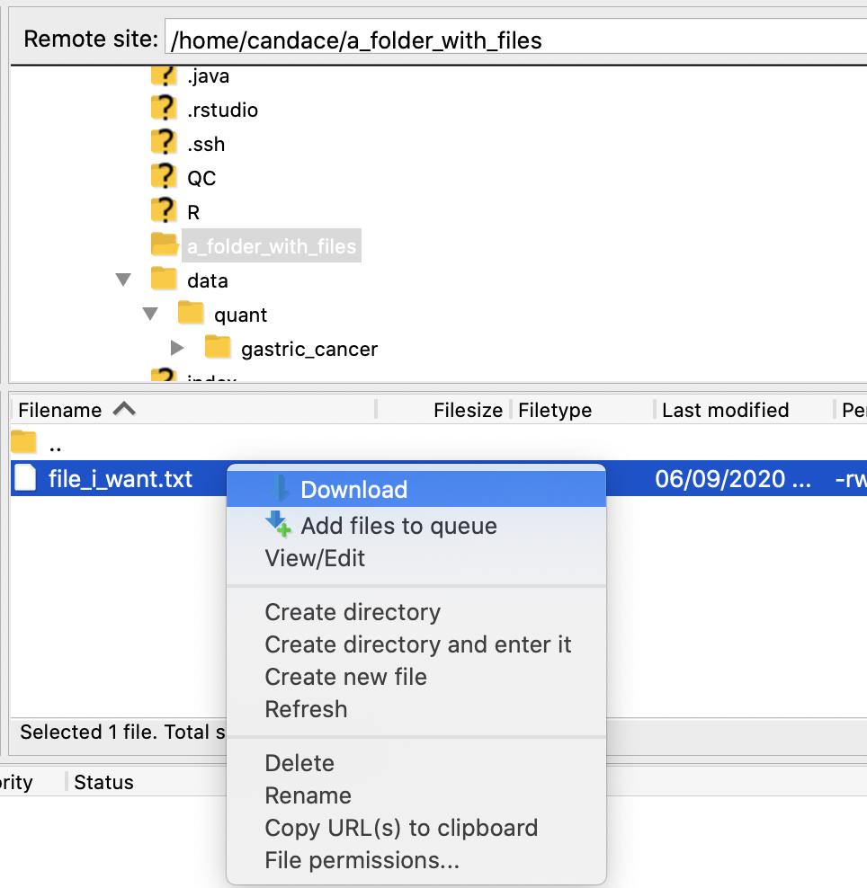

A progress bar on the bottom of the screen will tell you approximately how long it will take to download.

## Upload *small* files (<1 Gb) from your own computer

*This will only work for files smaller than 1GB*

If the data you want to use is stored locally on your computer, here's how we recommend uploading it to the RStudio Server.

**Step 1)** We recommend you compress your data folder into a single zip file.

For most operating systems, you can right-click on your data folder, and choose `Compress` to zip up your files
- [Windows zipping](https://support.microsoft.com/en-us/help/14200/windows-compress-uncompress-zip-files)
- [Mac zipping](https://www.imore.com/how-compress-file-your-mac)

For reference, here's how you [compress files from the command line](https://coolestguidesontheplanet.com/how-to-compress-and-uncompress-files-and-folders-in-os-x-lion-10-7-using-terminal/).

**Step 2)** Once your data is compressed to a single file, [navigate to your RStudio session](rstudio-login.md).

**Step 3)** Use the `Upload button` to choose your compressed data folder.

This button is in the lower right panel of your RStudio session:
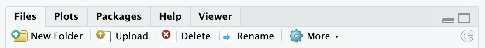

A mini screen will pop up asking you to choose the file you want to upload:

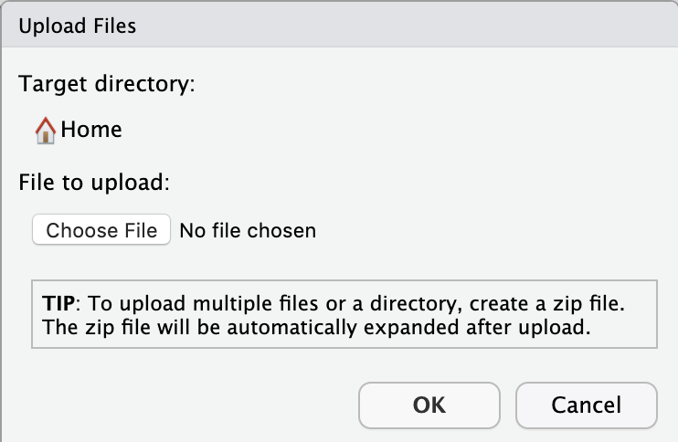

Choose your compressed data file, and click `OK`.
This may take some time, particularly if you have a large dataset.  

When the server is finished uploading your data, you should see your file in your `home` directory!
It will automatically be uncompressed.

## Download *small* files (<1Gb) to your computer

Any files on the RStudio server you would like to save to your computer you can export.

**Step 1)** Select the file(s) or folder(s) you would like to download
Check the box(es) to the left of the files or folder(s) in the **Files** pane.

**Step 2)** Use the Export button!

Click on the `More` button with a gear next to it in the lower right pane.

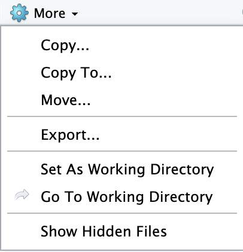

**Step 3)** Specify the name you would like the downloaded file to have.

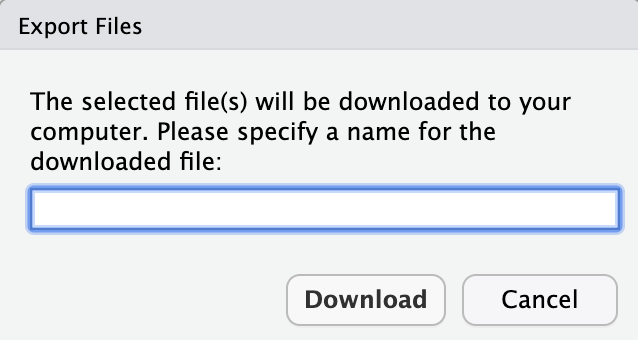

**Step 4)** Find where the file downloaded.
Your computer may show the file in the bottom left of your browser window.
You are likely to find your files in your `Downloads` folder!

## Installing packages

As you are working with your own data, you may find you want functionality from a package not yet installed to the RStudio server.
Here, we'll take you through some basics of how to install new packages.

### Finding what packages are installed

The RStudio Server has a list of packages installed for you already.
You can see this list of installed R packages by looking in the `Packages` tab:

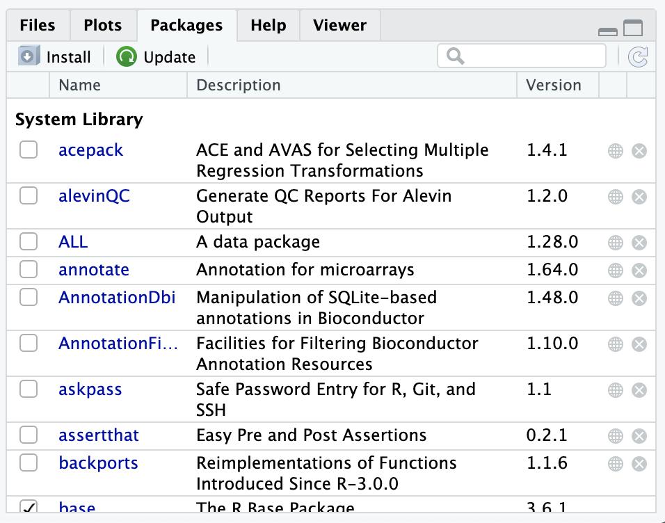

Or, by using the `installed.packages()` command in the `Console` tab.

Note that the checkmarks in the `Packages` tab indicate which packages are loaded currently in the environment.

### Installing a new package

Here we will take you through the most common R package installation steps and the most common roadblocks.
However, [*package dependencies*](http://r-pkgs.had.co.nz/description.html#dependencies), packages needing other packages to work (and specific versions of them!), can make this a [hairy process](https://en.wikipedia.org/wiki/Dependency_hell).
Because of this, we encourage you to reach out to one of the CCDL team members for assistance if you encounter problems beyond the scope of this brief introduction!

#### install.packages()

The Comprehensive R Archive Network or CRAN is a repository of packages that can all be installed with the `install.packages()` command.

In this example, we'll install `ggforce` which is a companion tool to `ggplot2` and is on CRAN.

We'll need to put quotes around `ggforce`!

```
install.packages("ggforce")
```

You should see output in the Console that shows some download bars, and finally some output that looks like this:

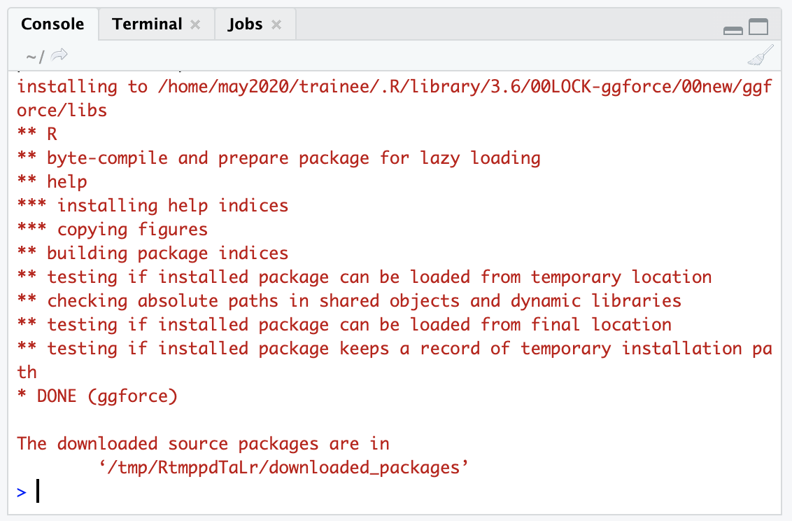

If your package installation is NOT successful, you'll see some sort of message like :

```
Warning in install.packages :
installation of package ‘ggforce’ had non-zero exit status
```

#### Bioconductor packages

Bioconductor has a collection of bioinformatics-relevant packages but requires different steps for installation.
These steps depend on `BiocManager` to be installed.

We have already installed `BiocManager` for you on the RStudio server, but on your computer you could install it by using `install.packages("BiocManager")` like we did in the previous section (Its on CRAN).

Since `BiocManager` is installed, (which you can check by using the [strategies in the above section](#finding-what-packages-are-installed)) then you can use the following command to install a package.
In this example, we'll install a package called `GenomicFeatures`.
```
BiocManager::install("GenomicFeatures")
```

You should get a similar successful installation message as in the previous section.  

Or if it failed to install, it will give you a `non-zero exit status` message.

### More resources on package installation strategies
- [Stack Overflow: Non-zero exit status](https://stackoverflow.com/questions/35666638/cant-access-user-library-in-r-non-zero-exit-status-warning)
- [Installing R packages](https://www.r-bloggers.com/installing-r-packages/)
- [Installing GitHub R Packages](https://cran.r-project.org/web/packages/githubinstall/vignettes/githubinstall.html)
