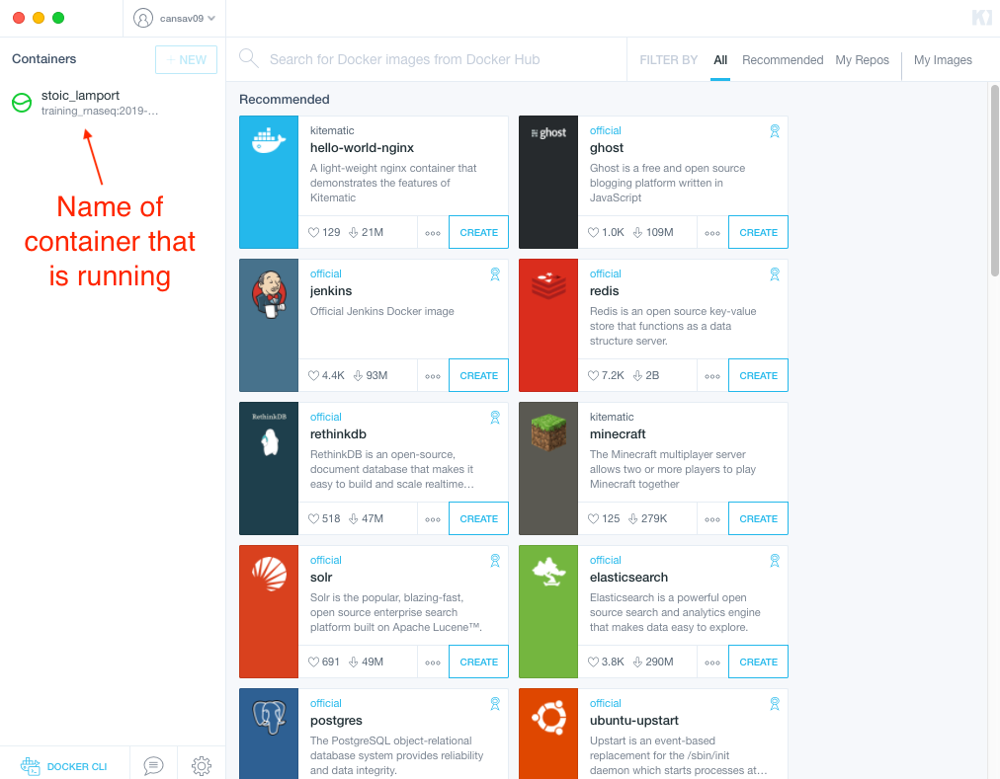
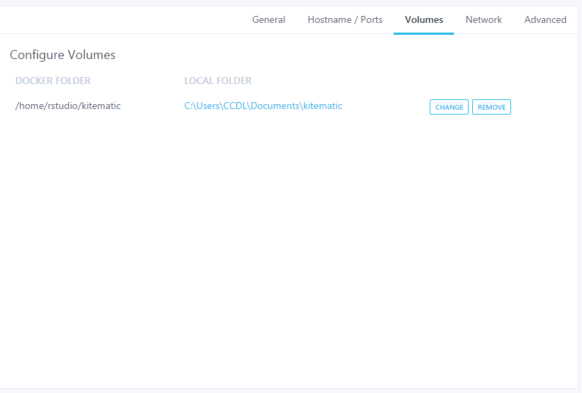
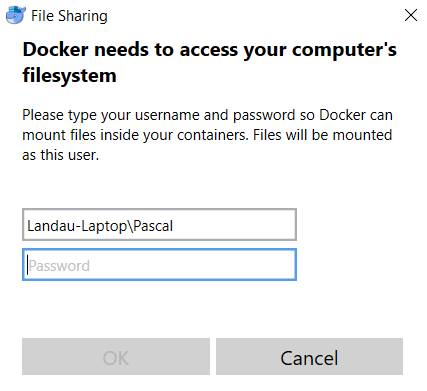
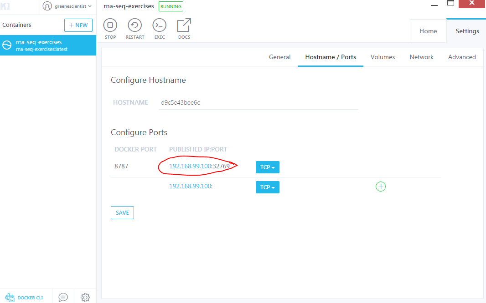

#### Background

You will continue to have access to RStudio Server and the files in your home directory for 6 months following this workshop.
We recognize there may be circumstances where you will need to process files locally.
Running the same software that we use for training locally can be challenging, particularly for Windows users.
(Some tools we use during our training modules, like Salmon, are not supported on Windows.)

Docker is software that allows us to package a computing environment such that it can be fully reproduced between different computers and operating systems; it is sometimes referred to as a "lightweight virtual machine."
We have put together a Docker image with the same software dependencies we use in training on the RStudio Server.
The image we use will allow you to access an RStudio Server in your local container via your web browser.

#### Docker installation

You can find instructions for installing Docker on your OS in the Docker documentation: <https://docs.docker.com/get-docker/>

#### Obtaining the Docker image

Once you've installed Docker, you will need to pull the appropriate image using command line.

- In *Mac*, search for and open `Terminal`.
- In *Windows*, search for and open `Command Prompt`.

In your respective command line interface, copy and paste the following:

```
docker pull {{site.docker_user}}/{{site.docker_repo}}:{{site.docker_tag}}
```

#### Running and interacting with the container

**To work with files on your computer, you will need to set a local folder as your volume.**
It is important to note that anything that you save to the Docker container but not in a local folder is ephemeral - once you destroy the container, it disappears!
For this reason, it's important to save anything you create in the `ccdl-training` folder in RStudio.

To set a local folder as your volume, we need to use [`--volume`](https://docs.docker.com/storage/volumes/) when we run the command to start the container.

What we provide to `--volume` follows a particular format: the folder on your computer that you want to read and write to and the location in the container to mount to, separated by a `:`. 
For this container, the second part will be `/home/rstudio/ccdl-training`.

If we were to have a folder on our computer located at `~/ccdl/training` we wanted to use, what we would use the following as part of our `docker run` command:

```
--volume ~/ccdl/training:/home/rstudio/ccdl-training
```

To run the container, change the `<PASSWORD>` in the line below to whatever you'd like and `<DIRECTORY ON YOUR COMPUTER>` to the folder on your computer that you'd like to read from and write to.

```
docker run \
  --volume <DIRECTORY ON YOUR COMPUTER>:/home/rstudio/ccdl-training
  -e PASSWORD=<PASSWORD> -p 8787:8787 {{site.docker_user}}/{{site.docker_repo}}:{{site.docker_tag}}
```

_You'll need to remove the angled brackets (`<` and `>`) around the password and directory for this to work!_

In a new window of your command line interface, run the following:

```
docker ps
```

This will essentially return a table, where one of the columns is called `PORTS`. 
For the image (`IMAGE` column), named `{{site.docker_user}}/{{site.docker_repo}}:{{site.docker_tag}}`, you will need to copy the text to the left of `->` from the ports column.
It should look like a series of 4 numbers separated by `.` and followed by `:8787`.
(On a Mac, this is likely `0.0.0.0:8787`.)
Paste that text into a web browser and hit enter.
This should bring up an RStudio window that you can log into with username `rstudio` and the password that you entered above.

Navigate to the `ccdl-training` folder in the `Files` pane in RStudio and check to make sure you can see the contents of the folder you supplied as `<DIRECTORY ON YOUR COMPUTER>` above.

#### Parting thoughts

Working with Docker can be tricky! If you run into trouble after training, you can always use Cancer Data Science Slack to ask questions.

<!--
First, open `Kitematic` - you should see an image running. Docker assigns a random name to your container. In the example below: "stoic_lamport".
If you don't see a container running, try quitting `Kitematic` and then opening it up again, or going to the toolbar > `View` > `Refresh Container List`.
<br><br>
 <br><br>

Navigate to  `Settings` > `Volumes` > Set local folder to the using the `CHANGE` button.<br><br>
<br><br>

*For Windows*: After you set `Volumes` you will may see a message in the lower right corner of your screen that asks if you would like to 'Share it' with Docker.
Click the `Share it` button; it will ask for your credentials. Enter your password and click `OK`.
<br><br>
 <br><br>

Now, navigate to RStudio window.

  - In a *Windows* or *Mac* in Kitematic, go to the `Settings` > `Hostname/Ports` tab and click on the blue lettering.
<br><br>  <br><br>

  - Alternatively, for a *Mac*, you can navigate to the RStudio window by typing `localhost:8787` in your web browser

Log into RStudio. The username will be `rstudio` and the password will be whatever you selected above.
(Your password can also be accessed from the `Settings` > `General` panel in Kitematic if you forget!)

You should see a `kitematic` folder in your RStudio `Files` panel.
When you click on it, you should see the contents of the local folder you connected above.
Saving any files outside of the `kitematic` folder is strongly discouraged, as they will disappear once you've destroyed the container.
-->
